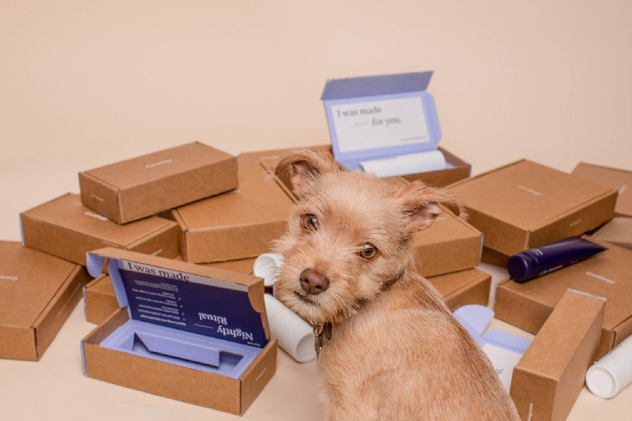

#### Subscriptions, Subscriptions, Subscriptions.

Every startup company these days tries to sell you a subscription.

Boxes of [random consignment knick-nacks](https://www.theapollobox.com/subscriptionbox). [Letters from dead people](https://cratejoy.evyy.net/c/468058/277724/4453?subId1=SpecificSubsOconnell1-19&u=https%3A%2F%2Fwww.cratejoy.com%2Fsubscription-box%2Fletters-from-dead-people%2F). [Skulls of dead animals](https://cratejoy.evyy.net/c/468058/277724/4453?subId1=SpecificSubscriptionsOConnell8-20&u=https%3A%2F%2Fwww.cratejoy.com%2Fsubscription-box%2Fskulls-unlimited-international-inc%2F). Paying for junk delivered straight to your doorstep each month [is the new, hottest trend in business](https://www.okwhatever.org/topics/things/weird-subscription-boxes).

The problem is, the bubble with subscription-based businesses removes consumer options, causes investors to demand companies switch pricing models, and promotes boom and bust businesses that seek to maximize profits in the short term and burn out _a la_ “fast fashion” (If the links above are dead, my point is made).

Certain products are best sold on a month-to-month basis. Netflix and other streaming services charge for the continued ability to watch millions of shows and movies on-demand without individually paying for each one. Gym memberships use the percentage of customers who signed up for their New Year’s Resolution but stopped attending two weeks in to subsidize the cost of regular gym-goers.

> “We realized the best way to monetize content was through a subscription model. “ — [Trip Adler](https://www.inc.com/jill-krasny/35-under-35-scribd-is-the-library-of-the-future.html), Scribd

However, what about a [scanner app that charges you $3.99 a week](https://apps.apple.com/us/app/scanner-app-scan-pdf-document/id1040093707) to convert photos to pdf? A notebook [that bills you $7.99 a month](https://www.bbc.com/news/technology-36662618) for the online syncing your default notes app offers for free?

The latter is Evernote, a company that originally shot to fame with the emergence of the App Store back in 2007. After years of having a 6% conversion rate on their freemium model ($5 a month or $45 a year) and steady growth and profits, in 2016, the company [restricted the number of features available to free accounts,](https://www.theguardian.com/technology/2016/jun/30/evernote-users-vent-anger-after-it-cuts-free-tier-and-raises-prices) bumping the cost of paid subscription up by 40% at the same time. When competitors in the industry such as Microsoft’s OneNote and free alternatives like Apple Notes grew in feature set and popularity, Evernote chose to restrict already-offered services and increase prices, leading to [TechCrunch’s 2018 article](https://techcrunch.com/2018/09/04/evernote-lost-its-cto-cfo-cpo-and-hr-head-in-the-last-month-as-it-eyes-another-fundraise/) describing Evernote as “in a death spiral.”

The case of Evernote depicts the obvious — customers abhor companies taking away previously free options and putting them behind a paywall. It’s difficult for a company to find a genuine reason for shifting previously successful pay-once pricing into recurring subscription models besides the desire for greater profits. And it does make bank.

Adobe in 2013 began selling their suite of products not on the perpetual license they did before but on what they called the Adobe Creative Cloud — [a $50/month subscription which removed the ability for users to purchase a license for a single product](https://www.cnet.com/news/adobe-competitors-pounce-after-subscription-backlash/) and forced them at gunpoint to pay monthly for all Adobe services. Their dirty tricks extended further [into even canceling already-purchased perpetual licenses if they accidentally signed up for a free trial of the subscription service](https://medium.com/@guisebule/subscription-psycho-a-person-who-knows-its-a-good-idea-to-get-you-away-from-perpetual-licensing-b8dec71bf7d0). In unrelated news, Adobe [saw a record quarterly revenue of $5.89 billion that year](https://www.cnbc.com/2016/03/18/adobe-raises-revenue-profit-forecasts-above-estimates-on-cloud-momentum.html).

Startups who see this as a golden goose need to realize something. While Adobe Photoshop, Microsoft Word, and other established design and productivity tools are invaluable necessities and part of the daily workflow of millions, your app likely is not. When non-essential services bill month after month, each time the notification pops up, the customer spends time and energy reconsidering whether to cancel or not — this leads to an incredibly high churn rate.

I understand the appeal of SaaS (Subscription as a Service) as a startup's de-facto pricing model. Stable and growing MOM (month over month) revenue growth was long considered the crown prince of trackable metrics for VCs. Founders seeking stability can feel pigeonholed into SaaS when trying to stay afloat for another funding round. However, the subscription model shouldn’t be a one-size-fits-all tool used to prop up deeply flawed ideas with the semblance of earnings stability, and founders should not feel pressured by stakeholders to raise bills and squeeze out every cent from the customer before a solid userbase has been developed.

The average consumer is already balancing several streaming subscription services, a gym membership, a phone plan, student loans, house and car debt, Amazon Prime, utility bills, insurance, credit cards, and Spotify Premium. They don’t want to see another monthly number chipping away at their bank balances month after month, year after year.

The worst part is, software companies already know the expected LTV (lifetime value) of their customer and argue over it and other metrics daily. If they had a separate “purchase permanently” option at that LTV price, undoubtedly there who choose to pay the lump sum would not have chosen to subscribe otherwise. For people like me who abhor paying monthly fees, you could even charge me more than my expected LTV, and in many cases, I would still pay that figure.

Poorly designed software pricing models are, in many ways, a digital version of the terrible “mystery box” subscription services, which continue to plague social media advertisements to this day. Both suffer from the same issues:

*   **Pricy solution in search of a cheap problem.** Why would consumers [pay a startup for safety razor cartridges](https://www.profitwell.com/recur/all/boxedout-dollar-shave-club) that cost 1/8th of the price to subscribe and save at Amazon? Similarly, why would anyone want to [pay a monthly subscription for an alarm clock app](https://www.tomsguide.com/us/pictures-story/641-best-clock-apps.html)?
*   **Lack of customer retention.** If a user pays upfront for a product, they will feel compelled to use it daily to get their money’s worth. Building brand loyalty [allows companies to upsell more items and services, gaining a cult following](https://www.retentionscience.com/blog/customer-loyalty-vs-brand-loyalty/). On the other hand, companies like Birchbox and subscription apps [can have up to a 20% monthly churn rate](https://recurly.com/research/churn-rate-benchmarks/).
*   **Boom and Bust model.** Box of the Month and high-profile subscription services like Quibi raise millions ([and the case of the latter 1.75 billion](https://techcrunch.com/2020/10/23/the-short-strange-life-of-quibi/#:~:text=A%20month%20ahead%20of%20its,give%20or%20take%20%24100%20million.)) in funding [yet fizzle out just as fast](https://news.crunchbase.com/news/venture-funding-subscription-startups-tapers-off/), burning through the capital on expensive marketing campaigns and celebrity endorsements rather than long-term investment or delivering actual value to the customer. Highly reminiscent of dropshipping scams.

While SaaS models work wonderfully for B2B and many industries, some apps and programs are best sold as-is, a buy-once and forget-about-it deal, which may not make the company an infinite-growth unicorn (do you really need [ten thousand employees](https://www.nytimes.com/2022/03/08/business/better-mortgage-lender-layoffs.html)) but can result in everyone involved living comfortable, financially secure lives with the resources to invest in their next great idea. Upselling through in-app purchases and notifications for other products in your ecosystem is easier when customers keep using your app because they don’t have to pay weekly or monthly to maintain it.

Investors and founders need to realize that removing options and placing them behind paywalls is only successful long-term when done by massive corporations with developed software ecosystems. Those companies don’t care about the negative PR or user base hit when most customers are locked in — a 5% customer base hit for an 8% increase in monthly revenue is a substantial win for them. When I can purchase a physical hardbound notebook every month for the price of a monthly notebook app subscription, there is not the same incentive for me to keep paying.

And to Adobe? I’m no anarchist, but keep this up [and watch the number of pirated copies of your software grow exponentially](https://www.revenera.com/blog/software-monetization/adobe-photoshop-creative-cloud-has-been-pirated/).

There are [creative ways to do pricing](https://dueapp.zendesk.com/hc/en-us/articles/360053244591-What-is-the-Upgrade-Pass-). The consumer wants to pay you — let them.