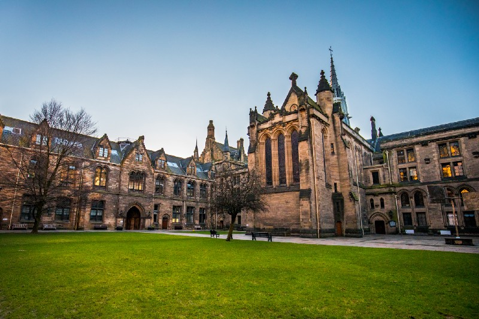
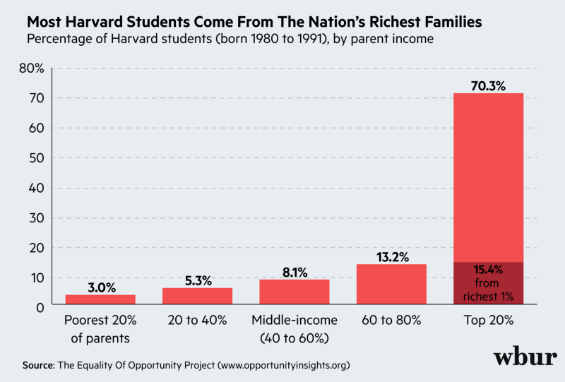
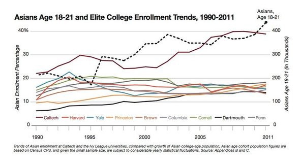

I followed the proceedings of _Students for Fair Admissions v. Harvard_ in October 2019 and remember feeling worried. I would submit my college applications in just two months from that day; to hear that my ethnicity might play a role in admissions was concerning.

Looking back, I distinctly remember taking steps to appear “less Asian.” I didn’t mention five years of piano lessons and instead stressed the gregarious and dramatic aspects of my personality. In place of focusing on computer science or entrepreneurship, I extolled my interests in the vocal arts, political advocacy, and classical literature. I hardly touched upon my Chinese cultural heritage, and, above all, I asked myself, “What would an older, straight, Caucasian admissions officer find unique about a male, Asian applicant from the Bay Area?”

Was I wrong to do that? Applications ask questions such as, “How can you add diversity to our community?” Mentioning aspects of myself that were uncommon for “people like me” is a plus, and, conversely, mentioning anything “common” — such as an Asian heritage — would be a minus, right? I remember asking myself, were Asian applicants, on average, simply less creative, less diverse? Faceless automatons who sought only to become a doctor or software engineer? Should universities have quotas lest American higher education becomes, in the words of an anonymous commenter, “Chinatown University?”

> “What would an older, straight, Caucasian admissions officer find unique about a male, Asian applicant from the Bay Area?”

I do not have definitive answers for these questions, and discussions regarding race issues in the United States are a faux pas — unless you intend to ruin Thanksgiving dinner for everyone.

Under the lens of capitalism, there is little-to-no reason to admit many Asian Americans. As the children of immigrants, we are often frugal (unwilling to become committed donors), are unlikely to gain considerable political power (1.25% of Congress), and have little social representation (in Hollywood or Wall Street). Instead, international Asian students from places such as Singapore, Hong Kong, and Shanghai supplant domestic applicants, wealthy foreign families gladly paying six-figure tuition fees to give their children American educations.

After all, private universities are for-profit institutions, and when the wealthy and powerful send their kids to your university, it’s a win-win situation. Prestigious schools earn their spot at the top by reinvesting in deep alumni networks, courting wealthy donors, and using their position of power to advance their reputation and further recruit the next generation of talent.

> “43% of white Harvard admittees \[are\] recruited athletes, friends and family of staff, and legacy.” — [Legacy and Athlete Preferences at Harvard](https://www.nber.org/papers/w26316#:~:text=Harvard%20University%20provided%20an%20unprecedented,faculty%20and%20staff%20%28ALDCs%29.).

The cynical part of me whispers that, if they could, many top universities would only admit the rich and well-connected, selecting only a few hand-picked stars out of the rest. Perhaps viewing college admissions as a battle between “the races” ignores the true effect that social class and engrained privilege have, though I would like to avoid any further broadening of political discussion in this article (race issues are controversial enough). Instead, here’s a chart:

My parents were immigrants from China. They grew up with _Gao Kao_, the Chinese college entrance exam, looming over their head, an ever-present sorting hat of their future success. The idea of a single test, one result determining your future, is shared among Asian countries, an “inside joke” like overly strict parents, which one laughs about in public then cries about in private.

Students who study for the same standardized test all review identical material. There is no room for “creativity” or “unique interests.” The test selects those who can perform the skills and tasks called for with perfect precision. I find them droll and mechanical, but I do concur; they are unlikely to be cheated, with no room for ghostwritten essays or fake nonprofits.

Relatively homogenous groups largely segregated by region combined with a more conservative culture means Chinese universities have less to worry about demographical diversity. The _Gao Kao_ provides affirmative action in its own way by adding points to the examination scores of minorities.

> “Students from other ethnic minority groups can receive 10 extra points, while those from remote areas, such as those from mountainous areas, can get anywhere from 10 to 30 extra points regardless of their ethnicity, the policy said.” — [_Global Times_](http://www.globaltimes.cn/content/1108492.shtml)

I am a pragmatist at heart, so the idea of a flat score boost granted to those of an underrepresented minority group — and another if the applicant is from a low-income family — appears to be a simple answer to a complicated problem. However, U.S. universities do not evaluate applicants on a standardized scale, and the higher you go, the more esoteric the candidate traits sought seem to become. There does not seem to be any possible way to unify the college view of applicant race (and wealth) on admissions besides a strict government-regulated policy, which is unlikely to happen for private universities anytime soon. Even the current Department of Justice’s claim against Yale is unlikely to bear any long-term consequence.

Besides, reducing one’s socioeconomic circumstances to a number adjustment gives off an unpleasant feeling to me.

Is there no solution then? Do we live in a zero-sum world where to give more opportunities to marginalized racial groups who have suffered from redlining and discrimination, we must choose another to sacrifice in its place?

I don’t think so. There are ways to fix racial differences without using quotas. Universities can begin with increasing admitted students — far easier as many campuses continue to be empty due to the pandemic. Instead of fighting over the pie, we can increase its size and cut costs while we do it. [Scott Galloway](https://medium.com/u/a76508074bec) has some [brilliant articles on this](https://www.profgalloway.com/post-corona-higher-ed-part-deux/).

Spend money creating education and developmental opportunities in low-income areas. Decrease the effectiveness of legacy and “friends and family of staff” on admissions chances. Realize that universities are the symbol of America’s future, of a new generation of educated youths who will break with the old and invent the new. They should not be burdened by believing they were admitted or rejected to a university because of factors they were born with and cannot change — or whether or not their parents play golf on Sundays with the dean ([Caltech](https://www.cnbc.com/2019/03/16/top-universities-that-do-not-consider-legacy-when-admitting-students.html#:~:text=The%20public%20institutions%20on%20the,do%20not%20consider%20legacy%20status.) and [MIT](https://mitadmissions.org/blogs/entry/just-to-be-clear-we-dont-do-legacy/) seem to be doing quite fine so far).

For now, however, I acknowledge affirmative action as an imperfect but acceptable tool to increase diversity until our educational system can get itself in order. Perhaps Covid-19 will cause an awakening in the need for affordable public education for all. Maybe the problematic stereotypes of Asians as “model minorities” will disappear as well.

I doubt it.